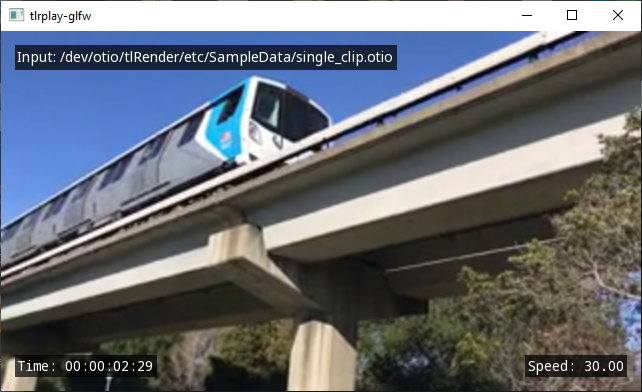
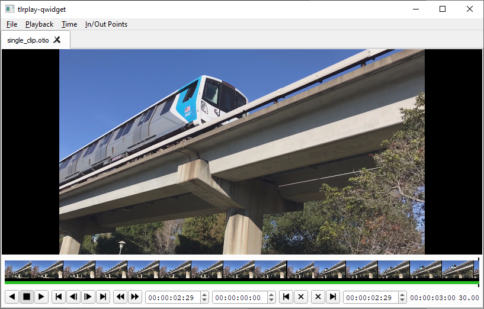

[](https://opensource.org/licenses/BSD-3-Clause)
[](https://github.com/darbyjohnston/tlRender/actions/workflows/ci-workflow.yml)


tlRender
========
tlRender, or timeline render, is an early stage project for rendering
editorial timelines.

The project includes libraries for rendering timelines with OpenGL and
Qt, and example applications showing the usage of the libraries. 

The project is written in C++ and uses OpenTimelineIO
(https://github.com/PixarAnimationStudios/OpenTimelineIO) for reading
timelines. FFmpeg (https://ffmpeg.org/) and other open source libraries
are used for movie and image I/O. The tlRender code is provided under
a BSD style open source license.

Supported:
* Movie clips
* Image sequences (Cineon, DPX, JPEG, OpenEXR, PNG, TIFF)
* Transitions
* Gaps

To do:
* Effects
* Audio support
* Hardware movie decoding
* Rendering to file
* Nested timelines
* Python bindings


Libraries
=========

tlrCore
-------
The core library providing timeline functionality, file I/O, and other
utilities.

Dependencies:
* OpenTimelineIO - https://github.com/PixarAnimationStudios/OpenTimelineIO
* FSeq - https://github.com/darbyjohnston/FSeq
* ZLIB - https://zlib.net

Optional dependencies:
* FFmpeg - https://ffmpeg.org
* JPEG - https://libjpeg-turbo.org
* OpenEXR - https://www.openexr.com/
* PNG - https://libpng.sourceforge.io/index.html
* TIFF - http://www.libtiff.org

tlrGL
-----
Timeline rendering using OpenGL.

Dependencies:
* glad - https://github.com/Dav1dde/glad
* FreeType - https://www.freetype.org

tlrQt
-----
Qt widgets and objects for rendering and controlling timelines.

Dependencies:
* Qt - https://www.qt.io

tlrApp
------
Utility library for the example applications.


Examples
========

tlrplay-glfw
------------


The example application "tlrplay-glfw" plays back timelines using
tlRender with GLFW.

Timelines can be opened from the command line. A HUD (heads up display),
keyboard shortcuts, and command line options provide controls for the
application. 

Dependencies:
* GLFW - https://www.glfw.org

tlrplay-qwidget
---------------


The example application "tlrplay-qwidget" plays back timelines using
tlRender with a QWidget application.

Timelines can be opened from the "File/Open" menu, drag and dropped onto the
window, or from the command line. Menus, playback buttons, a frame slider,
and keyboard shortcuts provide controls for the application.

tlrbake-glfw
------------
The example application "tlrbake-glfw" is a command-line application for
rendering a timeline to a movie file or image file sequence.


Building
========

Dependencies
------------
A CMake super build script is provided to build the dependencies from source.

Note that Qt is not included in the super build, you must install it separately.
Make sure that the QTDIR environment variable is set to the location of the Qt
install.

CMake Build Options
-------------------
* TLR_ENABLE_PYTHON - Enable Python support (for OTIO Python adapters)
* TLR_BUILD_FFmpeg - Build FFmpeg support (Linux and macOS only)
* TLR_BUILD_JPEG - Build JPEG support
* TLR_BUILD_OpenEXR - Build OpenEXR support
* TLR_BUILD_PNG - Build PNG support
* TLR_BUILD_TIFF - Build TIFF support
* TLR_BUILD_GL - Build OpenGL support (tlrGL library)
* TLR_BUILD_QT - Build QT support (tlrQt library)
* TLR_BUILD_EXAMPLES - Build examples

Building on Linux
-----------------
Clone the repository:
```
git clone https://github.com/darbyjohnston/tlRender.git
cd tlRender
```
Create a build directory:
```
mkdir build
cd build
```
Run CMake with the super build script:
```
cmake ../etc/SuperBuild/ -DCMAKE_INSTALL_PREFIX=$PWD/install -DCMAKE_PREFIX_PATH=$PWD/install -DCMAKE_BUILD_TYPE=Debug
```
Start the build:
```
cmake --build . -j 4
```
Try running the "tlrplay-glfw" application:
```
export LD_LIBRARY_PATH=$PWD/install/lib:$LD_LIBRARY_PATH
./install/bin/tlrplay-glfw ../etc/SampleData/multiple_clips.otio
```

Building on Linux with Qt
-------------------------
Clone the repository:
```
git clone https://github.com/darbyjohnston/tlRender.git
cd tlRender
```
Create a build directory:
```
mkdir build
cd build
```
Run CMake with the super build script, adding the location of "Qt5Config.cmake" to "CMAKE_PREFIX_PATH"
(make sure to use quotes), and enabling "TLR_BUILD_QT":
```
cmake ../etc/SuperBuild/ -DCMAKE_INSTALL_PREFIX=$PWD/install -DCMAKE_PREFIX_PATH="$PWD/install;$HOME/Qt/5.15.2/gcc_64/lib/cmake/Qt5" -DTLR_BUILD_QT=ON -DCMAKE_BUILD_TYPE=Debug
```
Start the build:
```
cmake --build . -j 4
```
Try running the "tlrplay-qwidget" application:
```
export LD_LIBRARY_PATH=$PWD/install/lib:$LD_LIBRARY_PATH
./install/bin/tlrplay-qwidget ../etc/SampleData/multiple_clips.otio
```

Building on macOS
-----------------
Clone the repository:
```
git clone https://github.com/darbyjohnston/tlRender.git
cd tlRender
```
Create a build directory:
```
mkdir build
cd build
```
Run CMake with the super build script:
```
cmake ../etc/SuperBuild/ -DCMAKE_INSTALL_PREFIX=$PWD/install -DCMAKE_PREFIX_PATH=$PWD/install -DCMAKE_BUILD_TYPE=Debug
```
Start the build:
```
cmake --build . -j 4
```
Try running the "tlrplay-glfw" application:
```
./install/bin/tlrplay-glfw ../etc/SampleData/multiple_clips.otio
```

Building FFmpeg on Windows
--------------------------
Most of the third party software that tlRender depends upon is built as part
of the CMake super build, except for FFmpeg on Windows. Instead the Windows
Subsystem for Linux (WSL) is used to compile FFmpeg as a separate step before
the CMake super build.

Enable the Windows Subsystem for Linux:

* Open the Windows control panel and click on "Programs and Features"
* Click on "Turn Windows features on or off" on the left side of the "Programs and Features" window
* Check the "Windows Subsystem for Linux" item in the "Windows Features" window
* Restart your computer

Install Ubuntu from the Windows app store, then open a shell and install necessary software:
```
sudo apt update
sudo apt install mingw-w64 yasm make unzip
```

Build FFmpeg, replacing $SOURCE_DIR and $BUILD_DIR with the same directories used in the
"Building on Windows" section:
```
$SOURCE_DIR/etc/Windows/build_ffmpeg_wsl.sh $BUILD_DIR/install
```

Building on Windows
-------------------
Clone the repository:
```
git clone https://github.com/darbyjohnston/tlRender.git
cd tlRender
```
Create a build directory:
```
mkdir build
cd build
```
Run CMake with the super build script:
```
cmake ../etc/SuperBuild/ -DCMAKE_INSTALL_PREFIX=%CD%/install -DCMAKE_PREFIX_PATH=%CD%/install -DCMAKE_BUILD_TYPE=Debug
```
Start the build:
```
cmake --build . -j 4 --config Debug
```
Try running the "tlrplay-glfw" application:
```
set PATH=%CD%\install\bin;%PATH%
.\install\bin\tlrplay-glfw ..\etc\SampleData\multiple_clips.otio
```

Building on Windows with Qt
---------------------------
Clone the repository:
```
git clone https://github.com/darbyjohnston/tlRender.git
cd tlRender
```
Create a build directory:
```
mkdir build
cd build
```
Run CMake with the super build script, adding the location of "Qt5Config.cmake" to "CMAKE_PREFIX_PATH"
(make sure to use quotes), and enabling "TLR_BUILD_QT":
```
cmake ../etc/SuperBuild/ -DCMAKE_INSTALL_PREFIX=%CD%/install -DCMAKE_PREFIX_PATH="%CD%/install;C:\Qt\5.15.2\msvc2019_64\lib\cmake\Qt5" -DTLR_BUILD_QT=ON -DCMAKE_BUILD_TYPE=Debug
```
Start the build:
```
cmake --build . -j 4 --config Debug
```
Try running the "tlrplay-qwidget" application:
```
set PATH=%CD%\install\bin;%PATH%
.\install\bin\tlrplay-qwidget ..\etc\SampleData\multiple_clips.otio
```
