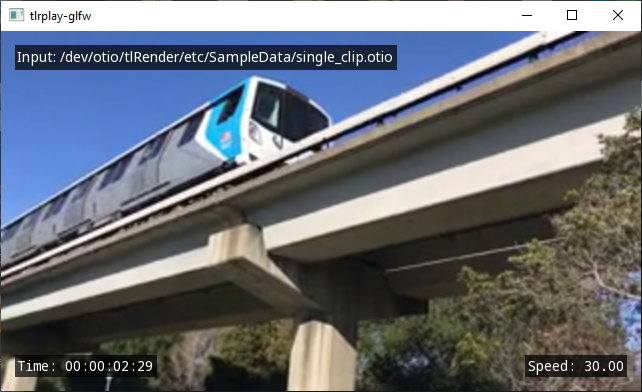
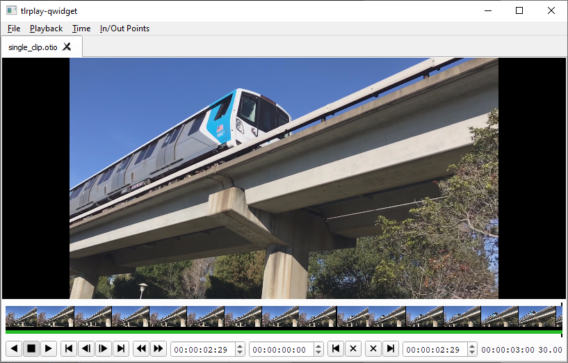

[](https://opensource.org/licenses/BSD-3-Clause)
[](https://github.com/darbyjohnston/tlRender/actions/workflows/ci-workflow.yml)
[](https://codecov.io/gh/darbyjohnston/tlRender)

tlRender
========
tlRender is an open source library for rendering editorial timelines used in
visual effects, film, and animation.

The library can be used for building playback and review applications that
support timelines with multiple video clips, image sequences, audio clips,
and transitions. 

The tlRender source code is provided under a BSD style open source license.

Supported:
* Mutiple movie clips, image sequences (Cineon, DPX, JPEG, OpenEXR, PNG, TIFF),
  audio clips, and transitions
* Color management with OpenColorIO

To do:
* Effects
* GPU movie decoding
* Nested timelines
* Python bindings


Libraries
=========

tlrCore
-------
The core library providing rendering, playback, file I/O, and basic
utilities.

Dependencies:
* [OpenTimelineIO](https://github.com/PixarAnimationStudios/OpenTimelineIO)
* [OpenColorIO](https://github.com/AcademySoftwareFoundation/OpenColorIO)
* [FSeq](https://github.com/darbyjohnston/FSeq)
* [ZLIB](https://zlib.net)

Optional dependencies:
* [FFmpeg](https://ffmpeg.org)
* [JPEG](https://libjpeg-turbo.org)
* [OpenEXR](https://www.openexr.com/)
* [PNG](https://libpng.sourceforge.io/index.html)
* [TIFF](http://www.libtiff.org)

tlrGL
-----
Timeline rendering using OpenGL.

Dependencies:
* [glad](https://github.com/Dav1dde/glad)
* [FreeType](https://www.freetype.org)

tlrQt
-----
Qt objects for working with timelines.

Dependencies:
* [Qt](https://www.qt.io)

tlrQWidget
----------
Qt widgets for working with timelines.

Dependencies:
* [Qt](https://www.qt.io)

tlrQuick
--------
Qt Quick widgets for working with timelines.

Dependencies:
* [Qt](https://www.qt.io)


Examples
========

play-glfw
------------


GLFW example application for timeline playback.

Dependencies:
* [GLFW](https://www.glfw.org)

play-qwidget
---------------


Qt widget example application for timeline playback.

play-quick
----------
Qt Quick example application for timeline playback.


Utilities
=========

tlrbake
-------
Command-line application for rendering a timeline to a movie or image sequence.


Building
========

Dependencies
------------
A CMake super build script is provided to build the dependencies from source.

Note however that Qt is not included in the super build, you must install it
separately.

CMake Build Options
-------------------
* TLR_ENABLE_MMAP - Enable memory-mapped file I/O
* TLR_ENABLE_GCOV - Enable gcov code coverage
* TLR_ENABLE_PYTHON - Enable Python support (for OTIO Python adapters)
* TLR_BUILD_GL - Build OpenGL library (tlrGL)
* TLR_BUILD_QT - Build Qt libraries (tlrQt, tlrQWidget, tlrQuick)
* TLR_BUILD_APPS - Build applications
* TLR_BUILD_EXAMPLES - Build examples
* TLR_BUILD_TESTS - Build tests
* TLR_BUILD_FFmpeg - Build FFmpeg support (Linux and macOS only)
* TLR_BUILD_JPEG - Build JPEG support
* TLR_BUILD_PNG - Build PNG support
* TLR_BUILD_OpenEXR - Build OpenEXR support
* TLR_BUILD_TIFF - Build TIFF support

Building on Linux
-----------------
Clone the repository:
```
git clone https://github.com/darbyjohnston/tlRender.git
cd tlRender
```
Create a build directory:
```
mkdir build
cd build
```
Run CMake with the super build script:
```
cmake ../etc/SuperBuild/ -DCMAKE_INSTALL_PREFIX=$PWD/install -DCMAKE_PREFIX_PATH=$PWD/install -DCMAKE_BUILD_TYPE=Debug
```
Start the build:
```
cmake --build . -j 4
```
Try running the "tlrplay-glfw" application:
```
export LD_LIBRARY_PATH=$PWD/install/lib:$LD_LIBRARY_PATH
./install/bin/tlrplay-glfw ../etc/SampleData/multiple_clips.otio
```

Building on Linux with Qt
-------------------------
Clone the repository:
```
git clone https://github.com/darbyjohnston/tlRender.git
cd tlRender
```
Create a build directory:
```
mkdir build
cd build
```
Run CMake with the super build script, adding the location of "Qt5Config.cmake" to "CMAKE_PREFIX_PATH"
(make sure to use quotes), and enabling "TLR_BUILD_QT":
```
cmake ../etc/SuperBuild/ -DCMAKE_INSTALL_PREFIX=$PWD/install -DCMAKE_PREFIX_PATH="$PWD/install;$HOME/Qt/5.15.2/gcc_64/lib/cmake/Qt5" -DTLR_BUILD_QT=ON -DCMAKE_BUILD_TYPE=Debug
```
Start the build:
```
cmake --build . -j 4
```
Try running the "tlrplay-qwidget" application:
```
export LD_LIBRARY_PATH=$PWD/install/lib:$LD_LIBRARY_PATH
./install/bin/tlrplay-qwidget ../etc/SampleData/multiple_clips.otio
```

Notes for building on Linux
---------------------------
Running gcovr for viewing code coverage:
```
gcovr -r ../../../../tlRender/lib/tlrCore --html --object-directory $PWD --html-details --output gcov.html
```

Building on macOS
-----------------
Clone the repository:
```
git clone https://github.com/darbyjohnston/tlRender.git
cd tlRender
```
Create a build directory:
```
mkdir build
cd build
```
Run CMake with the super build script:
```
cmake ../etc/SuperBuild/ -DCMAKE_INSTALL_PREFIX=$PWD/install -DCMAKE_PREFIX_PATH=$PWD/install -DCMAKE_BUILD_TYPE=Debug
```
Start the build:
```
cmake --build . -j 4
```
Try running the "tlrplay-glfw" application:
```
./install/bin/tlrplay-glfw ../etc/SampleData/multiple_clips.otio
```

Building on macOS with Qt
-------------------------
Clone the repository:
```
git clone https://github.com/darbyjohnston/tlRender.git
cd tlRender
```
Create a build directory:
```
mkdir build
cd build
```
Run CMake with the super build script, adding the location of "Qt5Config.cmake" to "CMAKE_PREFIX_PATH"
(make sure to use quotes), and enabling "TLR_BUILD_QT":
```
cmake ../etc/SuperBuild/ -DCMAKE_INSTALL_PREFIX=$PWD/install -DCMAKE_PREFIX_PATH="$PWD/install;$HOME/Qt/5.15.2/clang_64/lib/cmake/Qt5" -DTLR_BUILD_QT=ON -DCMAKE_BUILD_TYPE=Debug
```
Start the build:
```
cmake --build . -j 4
```
Try running the "tlrplay-qwidget" application:
```
./tlRender/src/tlRender-build/bin/tlrplay-qwidget/tlrplay-qwidget ../etc/SampleData/multiple_clips.otio
```

Notes for building on macOS
---------------------------
The CMake variable "CMAKE_OSX_ARCHITECTURES" can be used to specify the build
architecture:
```
-DCMAKE_OSX_ARCHITECTURES=x86_64
```

Building FFmpeg on Windows
--------------------------
Most of the third party software that tlRender depends upon is built as part
of the CMake super build, except for FFmpeg on Windows. Instead the Windows
Subsystem for Linux (WSL) is used to compile FFmpeg as a separate step before
the CMake super build.

Enable the Windows Subsystem for Linux:

* Open the Windows control panel and click on "Programs and Features"
* Click on "Turn Windows features on or off" on the left side of the "Programs and Features" window
* Check the "Windows Subsystem for Linux" item in the "Windows Features" window
* Restart your computer

Install Ubuntu from the Windows app store, then open a shell and install necessary software:
```
sudo apt update
sudo apt install mingw-w64 yasm make unzip
```

Build FFmpeg, replacing $SOURCE_DIR and $BUILD_DIR with the same directories used in the
"Building on Windows" section:
```
$SOURCE_DIR/etc/Windows/build_ffmpeg_wsl.sh $BUILD_DIR/install
```

Building on Windows
-------------------
Clone the repository:
```
git clone https://github.com/darbyjohnston/tlRender.git
cd tlRender
```
Create a build directory:
```
mkdir build
cd build
```
Run CMake with the super build script:
```
cmake ../etc/SuperBuild/ -DCMAKE_INSTALL_PREFIX=%CD%/install -DCMAKE_PREFIX_PATH=%CD%/install -DCMAKE_BUILD_TYPE=Debug
```
Start the build:
```
cmake --build . -j 4 --config Debug
```
Try running the "tlrplay-glfw" application:
```
set PATH=%CD%\install\bin;%PATH%
.\install\bin\tlrplay-glfw ..\etc\SampleData\multiple_clips.otio
```

Building on Windows with Qt
---------------------------
Clone the repository:
```
git clone https://github.com/darbyjohnston/tlRender.git
cd tlRender
```
Create a build directory:
```
mkdir build
cd build
```
Run CMake with the super build script, adding the location of "Qt5Config.cmake" to "CMAKE_PREFIX_PATH"
(make sure to use quotes), and enabling "TLR_BUILD_QT":
```
cmake ../etc/SuperBuild/ -DCMAKE_INSTALL_PREFIX=%CD%/install -DCMAKE_PREFIX_PATH="%CD%/install;C:\Qt\5.15.2\msvc2019_64\lib\cmake\Qt5" -DTLR_BUILD_QT=ON -DCMAKE_BUILD_TYPE=Debug
```
Start the build:
```
cmake --build . -j 4 --config Debug
```
Try running the "tlrplay-qwidget" application:
```
set PATH=%CD%\install\bin;%PATH%
.\install\bin\tlrplay-qwidget ..\etc\SampleData\multiple_clips.otio
```
