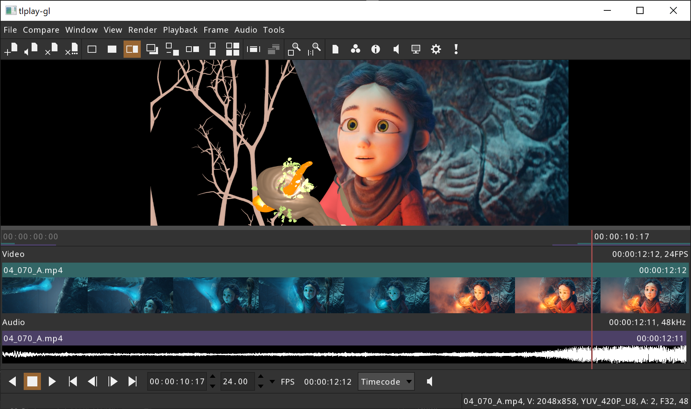

[](https://opensource.org/licenses/BSD-3-Clause)
[](https://github.com/darbyjohnston/tlRender/actions/workflows/ci-workflow.yml)
[](https://codecov.io/gh/darbyjohnston/tlRender)

tlRender
========
tlRender is an open source library for building playback and review
applications for visual effects, film, and animation.

The library can render and playback timelines with multiple video clips,
image sequences, audio clips, and transitions. Examples are provided for
integrating the library with Qt and OpenGL applications.

The library is written in C++ and uses the CMake build system.



This screenshot shows an example playback application built with the tlRender
user interface library. Two files are being compared with an A/B "wipe", a USD
animation and a rendered movie.

"Spring" content: © Blender Foundation | cloud.blender.org/spring

Currently supported:
* Movie files (H264, MP4, etc.)
* Image file sequences (Cineon, DPX, JPEG, OpenEXR, PNG, PPM, TIFF)
* Multi-channel audio
* Color management with OpenColorIO v2.2
* A/B comparison
* .otioz file bundles

Work in progress:
* USD support

To do:
* Software rendering
* Apple Metal rendering
* Microsoft DirectX rendering
* Effects
* GPU movie decoding
* Nested timelines
* Python bindings

Contents:
* [Dependencies](#dependencies)
* [Building](#building)
    * [Building Dependencies](#build-dependencies)
    * [CMake build options](#cmake-build-options)
    * [Building on Linux](#building-on-linux)
    * [Building on macOS](#building-on-macos)
    * [Building FFmpeg on Windows](#building-ffmpeg-on-windows)
    * [Building on Windows](#building-on-windows)


# Dependencies

Required dependencies:
* [FSeq](https://github.com/darbyjohnston/FSeq)
* [ZLIB](https://zlib.net)
* [GLM](https://github.com/g-truc/glm)
* [Imath](https://github.com/AcademySoftwareFoundation/Imath)
* [nlohmann_json](https://github.com/nlohmann/json)
* [minizip-ng](https://github.com/zlib-ng/minizip-ng)
* [OpenTimelineIO](https://github.com/PixarAnimationStudios/OpenTimelineIO)
* [FreeType](https://www.freetype.org)
* [GLFW](https://www.glfw.org/)

Optional dependencies:
* [OpenColorIO](https://github.com/AcademySoftwareFoundation/OpenColorIO)
* [RtAudio](https://github.com/thestk/rtaudio)
* [libsamplerate](https://github.com/libsndfile/libsamplerate)
* [JPEG](https://libjpeg-turbo.org)
* [TIFF](http://www.libtiff.org)
* [PNG](https://libpng.sourceforge.io/index.html)
* [OpenEXR](https://www.openexr.com/)
* [FFmpeg](https://ffmpeg.org)
* [nativefiledialog-extended](https://github.com/btzy/nativefiledialog-extended)
* [Qt version 5 or 6](https://www.qt.io)


# Building

## Building Dependencies

A CMake super build script is provided to build the dependencies from source,
except for Qt. Qt should be installed separately.

## CMake build options

| Name              | Description                                       | Default   |
| ----------------- | ------------------------------------------------- | --------- |
| TLRENDER_MMAP     | Enable memory-mapped file I/O                     | TRUE      |
| TLRENDER_PYTHON   | Enable Python support (for OTIO Python adapters)  | FALSE     |
| TLRENDER_GLFW     | Enable support for GLFW                           | TRUE      |
| TLRENDER_OCIO     | Enable support for OpenColorIO                    | TRUE      |
| TLRENDER_AUDIO    | Enable support for audio                          | TRUE      |
| TLRENDER_JPEG     | Enable support for JPEG                           | TRUE      |
| TLRENDER_TIFF     | Enable support for TIFF                           | TRUE      |
| TLRENDER_STB      | Enable support for STB I/O (TGA, BMP, PSD)        | TRUE      |
| TLRENDER_PNG      | Enable support for PNG                            | TRUE      |
| TLRENDER_EXR      | Enable support for OpenEXR                        | TRUE      |
| TLRENDER_FFMPEG   | Enable support for FFmpeg                         | TRUE      |
| TLRENDER_USD      | Enable support for USD                            | FALSE     |
| TLRENDER_BMD      | Enable support for Blackmagic Design devices      | FALSE     |
| TLRENDER_BMD_SDK  | Full path to the Blackmagic Design SDK            | ""        |
| TLRENDER_NFD      | Enable support for native file dialogs            | OS Dependent |
| TLRENDER_QT6      | Enable support for Qt6                            | FALSE     |
| TLRENDER_QT5      | Enable support for Qt5                            | FALSE     |
| TLRENDER_PROGRAMS | Build programs                                    | TRUE      |
| TLRENDER_EXAMPLES | Build examples                                    | TRUE      |
| TLRENDER_TESTS    | Build tests                                       | TRUE      |
| TLRENDER_GCOV     | Enable gcov code coverage                         | FALSE     |
| TLRENDER_GPROF    | Enable gprof code profiling                       | FALSE     |
| TLRENDER_GL_DEBUG | Enable OpenGL debugging                           | FALSE     |

## Building on Linux

Clone the repository:
```
git clone https://github.com/darbyjohnston/tlRender.git
cd tlRender
git submodule init
git submodule update
```
Create a build directory:
```
mkdir build
cd build
```
Run CMake with the super build script:
```
cmake ../etc/SuperBuild -DCMAKE_INSTALL_PREFIX=$PWD/install -DCMAKE_PREFIX_PATH=$PWD/install -DCMAKE_BUILD_TYPE=Debug
```
Start the build:
```
cmake --build . -j 4 --config Debug
```
Try running the "tlplay-gl" application:
```
export LD_LIBRARY_PATH=$PWD/install/lib:$LD_LIBRARY_PATH
./tlRender/src/tlRender-build/bin/tlplay-gl/tlplay-gl ../etc/SampleData/MultipleClips.otio
```

### Building on Linux with Qt 6

When running CMake with the super build script, add the Qt location to
"CMAKE_PREFIX_PATH" (make sure to use quotes), and enable "TLRENDER_QT6":
```
cmake ../etc/SuperBuild -DCMAKE_INSTALL_PREFIX=$PWD/install -DCMAKE_PREFIX_PATH="$PWD/install;$HOME/Qt/6.5.0/gcc_64" -DTLRENDER_QT6=ON -DCMAKE_BUILD_TYPE=Debug
```

### Building on Linux with Qt 5

When running CMake with the super build script, add the Qt location to
"CMAKE_PREFIX_PATH" (make sure to use quotes), and enable "TLRENDER_QT5":
```
cmake ../etc/SuperBuild -DCMAKE_INSTALL_PREFIX=$PWD/install -DCMAKE_PREFIX_PATH="$PWD/install;$HOME/Qt/5.15.2/gcc_64" -DTLRENDER_QT5=ON -DCMAKE_BUILD_TYPE=Debug
```

### Minimal build on Linux

Build with only the required dependencies, disabling all optional dependencies.
```
cmake ../etc/SuperBuild -DCMAKE_INSTALL_PREFIX=$PWD/install -DCMAKE_PREFIX_PATH=$PWD/install -DCMAKE_BUILD_TYPE=Debug -DTLRENDER_OCIO=OFF -DTLRENDER_AUDIO=OFF -DTLRENDER_JPEG=OFF -DTLRENDER_TIFF=OFF -DTLRENDER_STB=OFF -DTLRENDER_PNG=OFF -DTLRENDER_EXR=OFF -DTLRENDER_FFMPEG=OFF -DTLRENDER_PROGRAMS=OFF -DTLRENDER_EXAMPLES=OFF -DTLRENDER_TESTS=OFF
```

### Notes for building on Linux

Example for running gcovr for code coverage:
```
gcovr -r ../../../../lib --html --object-directory lib --html-details --output gcov.html lib/tlCore lib/tlIO lib/tlTimeline
```

## Building on macOS

Clone the repository:
```
git clone https://github.com/darbyjohnston/tlRender.git
cd tlRender
git submodule init
git submodule update
```
Create a build directory:
```
mkdir build
cd build
```
Run CMake with the super build script:
```
cmake ../etc/SuperBuild -DCMAKE_INSTALL_PREFIX=$PWD/install -DCMAKE_PREFIX_PATH=$PWD/install -DCMAKE_BUILD_TYPE=Debug
```
Start the build:
```
cmake --build . -j 4 --config Debug
```
Try running the "tlplay-gl" application:
```
./tlRender/src/tlRender-build/bin/tlplay-gl/tlplay-gl ../etc/SampleData/MultipleClips.otio
```

### Building on macOS with Qt 6

When running CMake with the super build script add the Qt location to
"CMAKE_PREFIX_PATH" (make sure to use quotes), and enable "TLRENDER_QT6":
```
cmake ../etc/SuperBuild -DCMAKE_INSTALL_PREFIX=$PWD/install -DCMAKE_PREFIX_PATH="$PWD/install;$HOME/Qt/6.5.0/macos" -DTLRENDER_QT6=ON -DCMAKE_BUILD_TYPE=Debug
```

### Building on macOS with Qt 5

When running CMake with the super build script add the Qt location to
"CMAKE_PREFIX_PATH" (make sure to use quotes), and enable "TLRENDER_QT5":
```
cmake ../etc/SuperBuild -DCMAKE_INSTALL_PREFIX=$PWD/install -DCMAKE_PREFIX_PATH="$PWD/install;$HOME/Qt/5.15.2/clang_64" -DTLRENDER_QT5=ON -DCMAKE_BUILD_TYPE=Debug
```

### Notes for building on macOS

The CMake variable "CMAKE_OSX_ARCHITECTURES" can be used to specify the build
architecture:
```
-DCMAKE_OSX_ARCHITECTURES=x86_64
```
```
-DCMAKE_OSX_ARCHITECTURES=arm64
```

These aliases are convenient for switching between architectures:
```
alias arm="env /usr/bin/arch -arm64 /bin/zsh --login"
alias intel="env /usr/bin/arch -x86_64 /bin/zsh --login"
```

## Building FFmpeg on Windows

Most of the third party software that tlRender depends upon is built as part
of the CMake super build, except for FFmpeg on Windows. Instead the Windows
Subsystem for Linux (WSL) is used to compile FFmpeg as a separate step before
the CMake super build.

Enable the Windows Subsystem for Linux:

* Open the Windows control panel and click on "Programs and Features"
* Click on "Turn Windows features on or off" on the left side of the "Programs and Features" window
* Check the "Windows Subsystem for Linux" item in the "Windows Features" window
* Restart your computer

Install Ubuntu from the Windows app store, then open a shell and install necessary software:
```
sudo apt update
sudo apt install mingw-w64 yasm make unzip
```

Build FFmpeg, replacing $SOURCE_DIR and $BUILD_DIR with the same directories used in the
"Building on Windows" section:
```
$SOURCE_DIR/etc/Windows/build_ffmpeg_wsl.sh $BUILD_DIR/install
```

## Building on Windows

Clone the repository:
```
git clone https://github.com/darbyjohnston/tlRender.git
cd tlRender
git submodule init
git submodule update
```
Create a build directory:
```
mkdir build
cd build
```
Run CMake with the super build script:
```
cmake ..\etc\SuperBuild -DCMAKE_INSTALL_PREFIX=%CD%\install -DCMAKE_PREFIX_PATH=%CD%\install -DCMAKE_BUILD_TYPE=Debug
```
Start the build:
```
cmake --build . -j 4 --config Debug
```
Try running the "tlplay-gl" application:
```
set PATH=%CD%\install\bin;%PATH%
.\tlRender\src\tlRender-build\bin\tlplay-gl\Debug\tlplay-gl ..\etc\SampleData\MultipleClips.otio
```

### Building on Windows with Qt 6

When running CMake with the super build script add the Qt location to
"CMAKE_PREFIX_PATH" (make sure to use quotes), and enable "TLRENDER_QT6":
```
cmake ..\etc\SuperBuild -DCMAKE_INSTALL_PREFIX=%CD%\install -DCMAKE_PREFIX_PATH="%CD%\install;C:\Qt\6.5.0\msvc2019_64" -DTLRENDER_QT6=ON -DCMAKE_BUILD_TYPE=Debug
```

### Building on Windows with Qt 5

When running CMake with the super build script add the Qt location to
"CMAKE_PREFIX_PATH" (make sure to use quotes), and enable "TLRENDER_QT5":
```
cmake ..\etc\SuperBuild -DCMAKE_INSTALL_PREFIX=%CD%\install -DCMAKE_PREFIX_PATH="%CD%\install;C:\Qt\5.15.2\msvc2019_64" -DTLRENDER_QT5=ON -DCMAKE_BUILD_TYPE=Debug
```
