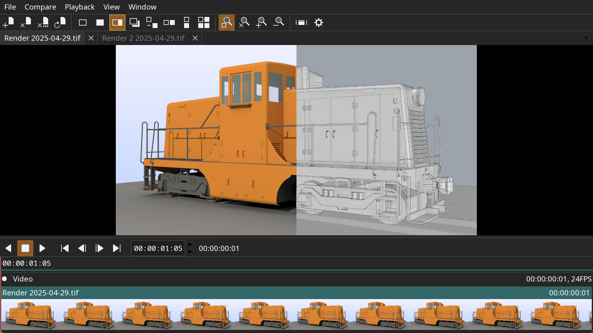

[](https://opensource.org/licenses/BSD-3-Clause)
[](https://github.com/darbyjohnston/tlRender/actions/workflows/ci-workflow.yml)
[](https://codecov.io/gh/darbyjohnston/tlRender)

# tlRender

tlRender is an open source library for building playback and review
applications for visual effects, film, and animation.

The library can render and playback timelines with multiple video clips,
image sequences, audio clips, and transitions. Examples are provided for
integrating the library with Qt and OpenGL applications.

The library is written in C++ and uses the CMake build system.

These screenshots show an example application built with tlRender. The
application is comparing two images with a wipe and horizontal layout.




Features:
* Support for timelines, image sequences, movies, and audio files
* A/B comparison with wipe, overlay, and difference modes
* Color management with OpenColorIO
* Multi-track audio with variable speed and reverse playback
* Experimental support for USD files
* Available for Linux, macOS, and Windows


## Building Dependencies

A CMake super build script is provided to build all of the dependencies from
source except for Qt. If building with Qt is enabled, it needs to be installed
separately.

Required dependencies:
* [feather-tk](https://github.com/darbyjohnston/feather-tk)
* [Imath](https://github.com/AcademySoftwareFoundation/Imath)
* [minizip-ng](https://github.com/zlib-ng/minizip-ng)
* [OpenTimelineIO](https://github.com/PixarAnimationStudios/OpenTimelineIO)

Optional dependencies:
* [OpenSSL](https://www.openssl.org)
* [libssh2](https://libssh2.org)
* [curl](https://curl.se/libcurl)
* [OpenColorIO](https://github.com/AcademySoftwareFoundation/OpenColorIO)
* [SDL2](https://www.libsdl.org)
* [JPEG](https://libjpeg-turbo.org)
* [TIFF](http://www.libtiff.org)
* [PNG](https://libpng.sourceforge.io/index.html)
* [OpenEXR](https://www.openexr.com/)
* [FFmpeg](https://ffmpeg.org)
* [OpenUSD](https://github.com/PixarAnimationStudios/OpenUSD)
* [Qt version 5 or 6](https://www.qt.io)


## Building on Linux

Dependencies:
* CMake 3.31

Install system packages (Debian based systems):
```
sudo apt-get install xorg-dev libglu1-mesa-dev mesa-common-dev mesa-utils libasound2-dev libpulse-dev
```

Install system packages (Rocky 9):
```
sudo dnf install libX11-devel libXrandr-devel libXinerama-devel libXcursor-devel libXi-devel mesa-libGL-devel pipewire-devel
```

Clone the repository:
```
git clone https://github.com/darbyjohnston/tlRender.git
```

Run the super build script:
```
sh tlRender/sbuild-linux.sh
```

Try running the `tlplay` application:
```
./build-Release/bin/tlplay/tlplay tlRender/etc/SampleData/MultipleClips.otio
```

To build with Qt 6 add the Qt location to `CMAKE_PREFIX_PATH` (place double
quotes around the list of paths) and enable `TLRENDER_QT6`.

Example running gcovr for code coverage:
```
gcovr -r ../../../../lib --html --object-directory lib --html-details --output gcov.html lib/tlCore lib/tlIO lib/tlTimeline
```


## Building on macOS

Dependencies:
* Xcode
* CMake 3.31

Clone the repository:
```
git clone https://github.com/darbyjohnston/tlRender.git
```

Run the super build script:
```
sh tlRender/sbuild-macos.sh
```

Try running the `tlplay` application:
```
./build-Release/bin/tlplay/tlplay tlRender/etc/SampleData/MultipleClips.otio
```

To build with Qt 6 add the Qt location to `CMAKE_PREFIX_PATH` (place double
quotes around the list of paths) and enable `TLRENDER_QT6`.

These aliases are convenient for switching between architectures:
```
alias arm="env /usr/bin/arch -arm64 /bin/zsh --login"
alias intel="env /usr/bin/arch -x86_64 /bin/zsh --login"
```


## Building on Windows

Dependencies:
* Visual Studio 2022
* CMake 3.31
* MSYS2 (https://www.msys2.org) for compiling FFmpeg.
* Strawberry Perl (https://strawberryperl.com/) for compiling network support.
* Python 3.11 for compiling USD.

Open the Visual Studio command console "x64 Native Tools Command Prompt for VS 2022".
This can be found in the Start menu, in the "Visual Studio 2022" folder.

Clone the repository:
```
git clone https://github.com/darbyjohnston/tlRender.git
```

Run the super build script:
```
tlRender\sbuild-win.bat
```

Try running the `tlplay` application:
```
set PATH=%CD%\install-Release\bin;%PATH%
```
```
.\build-Release\bin\tlplay\Release\tlplay tlRender\etc\SampleData\MultipleClips.otio
```

To build with Qt 6 add the Qt location to `CMAKE_PREFIX_PATH` (place double
quotes around the list of paths) and enable `TLRENDER_QT6`.
